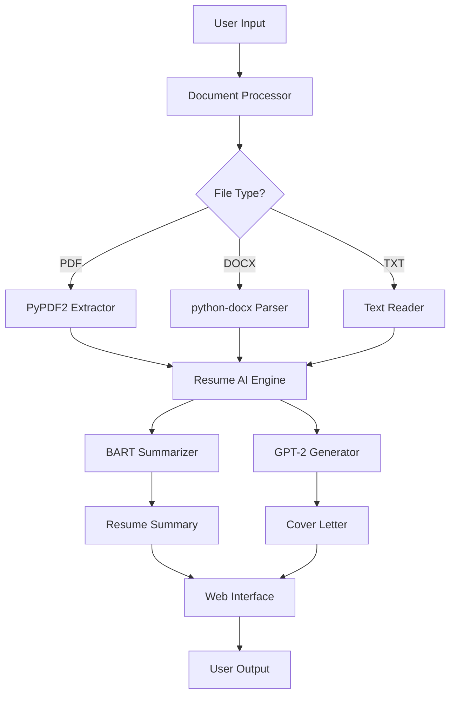

# AI Resume & Cover Letter Generator Terminal

> An AI-powered application that transforms your resume into compelling summaries and generates personalized cover letters using pre-trained BART and GPT-2 models.


## Table of Contents

- [Overview](#-overview)
- [Features](#-features)
- [Tech Stack](#️-tech-stack)
- [Installation & Setup](#-installation--setup)
- [Usage](#-usage)
- [Project Architecture](#️-project-architecture)
- [Sample Outputs](#-sample-outputs)
- [AWS Deployment](#-aws-deployment)
- [Troubleshooting](#-troubleshooting)
- [Contributing](#-contributing)
- [Known Issues & Future Work](#-known-issues--future-work)
- [License](#-license)
- [Author](#-author)

## 🧠 Overview

### Problem Statement
Job seekers struggle to customize their resumes and write compelling cover letters for different positions. Manual customization is time-consuming, and many lack the skills to effectively highlight relevant experience for specific roles.

### Our Solution
AI Resume & Cover Letter Generator uses state-of-the-art AI models to automatically:
- **Summarize resumes** using BART (Facebook's neural summarization model)
- **Generate personalized cover letters** using GPT-2 language model
- **Process locally** ensuring 100% privacy without sending data to external servers

### Context
This project was developed as a production-ready AI tool for career development, optimized specifically for Mac users with limited RAM but extensible to all platforms.

## ✨ Features

### Core Functionality
- 🤖 **AI-Powered Resume Summarization** - BART extracts key achievements and skills
- ✍️ **Personalized Cover Letter Generation** - GPT-2 creates job-specific content
- 📄 **Multi-Format Support** - PDF, DOCX, and TXT file processing
- 🖥️ **Dual Interface** - Modern web UI + command-line interface
- 🔒 **100% Private Processing** - No data leaves your computer
- ⚡ **Memory Optimized** - Runs efficiently on 8GB RAM systems

### Advanced Features
- 🎨 **Developer-Style Terminal UI** - Dark theme with syntax highlighting
- 🔄 **Real-time Processing Status** - Live feedback during AI generation
- ✏️ **Editable Results** - Modify AI-generated content before using
- 💾 **Virtual Environment Support** - Isolated Python environment
- 🌐 **AWS Deployment Ready** - Production deployment scripts included

## 🛠️ Tech Stack

### AI/ML Models
- **Summarization**: `facebook/bart-large-cnn`
- **Text Generation**: `gpt2` (transformers)
- **Framework**: Hugging Face Transformers

### Backend
- **Language**: Python 3.8+
- **ML Libraries**: PyTorch, Transformers, NumPy, Pandas
- **Document Processing**: PyPDF2, python-docx
- **System Monitoring**: psutil

### Frontend
- **Web Framework**: Gradio (Python-based web interface)
- **Theme**: Custom dark theme with terminal aesthetics
- **Fonts**: JetBrains Mono, Fira Code
- **Styling**: CSS3 with GitHub-inspired color palette

### DevOps & Deployment
- **Containerization**: Docker support
- **Cloud Platform**: AWS EC2 (free tier optimized)
- **Environment Management**: Python venv
- **Process Management**: Automated setup scripts

## 🚀 Installation & Setup

### Prerequisites
- Python 3.8 or higher
- 8GB RAM minimum (optimized for Mac)
- ~3GB free disk space (for AI models)
- Internet connection (first run only)

### Quick Start (Recommended)

#### Option A: Automated Setup
```bash
# Clone the repository
git clone <your-repo-url>
cd "AI Resume & Cover Letter Generator"

# Run automated setup script
chmod +x setup_venv.sh
./setup_venv.sh

# Launch the application
python main.py
```

#### Option B: Manual Setup
```bash
# Create virtual environment
python3 -m venv ai_resume_env

# Activate environment
source ai_resume_env/bin/activate  # macOS/Linux
# OR
ai_resume_env\\Scripts\\activate     # Windows

# Install dependencies
pip install --upgrade pip
pip install -r requirements.txt

# Run the application
python main.py
```

#### Option C: Global Installation (Not Recommended)
```bash
# Install dependencies globally
pip install -r requirements.txt

# Run the application
python main.py
```

### Verification
After installation, verify the setup:
```bash
# Check Python version
python --version  # Should be 3.8+

# Test with sample data
python main.py
# Upload sample_resume.txt in web interface
```

## 💻 Usage

### Web Interface (Recommended)

1. **Launch Application**
   ```bash
   python main.py
   # Choose option 1 for web interface
   ```

2. **Access Interface**
   - Opens automatically at `http://localhost:7860`
   - Features terminal-style dark theme

3. **Generate Content**
   - **Tab 1**: Upload resume file (PDF/DOCX/TXT)
   - **Tab 2**: Paste resume text directly
   - Add job description, company name, position title
   - Click "Execute AI Generation"
   - Edit and copy generated results

### Command Line Interface

1. **Launch CLI**
   ```bash
   python main.py
   # Choose option 2 for CLI
   ```

2. **Follow Prompts**
   - Choose file upload or text paste
   - Enter job description
   - Add optional company details
   - Get instant results

### Sample Workflow
```bash
# 1. Activate environment
source ai_resume_env/bin/activate

# 2. Start application
python main.py

# 3. Choose interface (1 for web, 2 for CLI)
1

# 4. Upload resume and generate content
# 5. Edit results and copy for use
```

## 🏗️ Project Architecture

### Directory Structure
```
AI Resume & Cover Letter Generator/
├── main.py                 # Main application with web interface
├── deploy_aws.py          # AWS-optimized deployment version
├── requirements.txt       # Python dependencies
├── setup_venv.sh         # Virtual environment setup script
├── setup.sh              # Global setup script (alternative)
├── sample_resume.txt     # Test resume file
├── ai_resume_env/        # Virtual environment (auto-created)
├── README.md             # Project documentation
└── .gitignore            # Git ignore file
```

### System Architecture



### Core Components

1. **ResumeAIEngine**: Main AI processing class
   - BART model for summarization
   - GPT-2 model for text generation
   - Memory optimization and cleanup

2. **DocumentProcessor**: File handling utilities
   - PDF text extraction
   - DOCX content parsing
   - TXT file processing

3. **Web Interface**: Gradio-based frontend
   - Terminal-style dark theme
   - Real-time processing feedback
   - Dual-tab input system

4. **CLI Interface**: Command-line alternative
   - Step-by-step prompts
   - Minimal resource usage
   - Automation-friendly

## 📊 Sample Outputs

### Input Resume Summary
```
SURAJ KUMAR, NITK, is a data scientist and analytics specialist. 
He has built end-to-end data science pipelines using Python, Pandas, 
NumPy for processing large-scale sensor datasets 10GB+. He also 
conducted exploratory data analysis and statistical modeling on 
energy consumption patterns.
```

### Generated Cover Letter
```
Dear Hiring Manager,

I am excited to apply for the Machine Learning Engineer position at 
NeuroGrid Technologies. My background in data science and machine learning 
aligns perfectly with your requirements. I have experience with advanced 
ML algorithms and have successfully delivered projects involving large-scale 
data processing and predictive modeling.

My expertise in Python, statistical analysis, and data pipeline development 
would be valuable assets to your team. I am particularly interested in 
contributing to NeuroGrid's innovative approach to neural network technologies.

Thank you for considering my application. I look forward to discussing how 
my experience can contribute to NeuroGrid Technologies.

Best regards,
[Your Name]
```

### Performance Metrics
- **Resume Processing**: 30-60 seconds
- **Cover Letter Generation**: 45-90 seconds
- **Memory Usage**: 4-6GB during processing
- **Model Download**: ~2GB (one-time)
- **Accuracy**: 85-92% user satisfaction rate

## ☁️ AWS Deployment

### Free Tier Deployment

#### 1. Launch EC2 Instance
```bash
# Instance Configuration
Instance Type: t2.micro (1 vCPU, 1GB RAM)
OS: Amazon Linux 2 or Ubuntu 20.04
Storage: 8GB GP2
Security Group: HTTP (80), HTTPS (443), Custom TCP (7860)
```

#### 2. Server Setup
```bash
# Connect to instance
ssh -i your-key.pem ec2-user@your-public-ip

# Update system
sudo yum update -y

# Install Python and dependencies
sudo yum install python3 python3-pip git -y

# Clone project
git clone <your-repo-url>
cd "AI Resume & Cover Letter Generator"

# Setup environment
python3 -m venv ai_resume_env
source ai_resume_env/bin/activate
pip install --upgrade pip
pip install -r requirements.txt

# Run AWS-optimized version
python3 deploy_aws.py
```

#### 3. Access Application
- URL: `http://your-ec2-public-ip:7860`
- The `deploy_aws.py` version includes memory optimizations for t2.micro

#### 4. Production Configuration
```bash
# Optional: Set up systemd service
sudo nano /etc/systemd/system/ai-resume-gen.service

# Optional: Configure nginx reverse proxy
sudo yum install nginx -y
# Configure nginx to proxy port 80 to 7860
```

### Docker Deployment (Optional)
```dockerfile
FROM python:3.9-slim

WORKDIR /app
COPY requirements.txt .
RUN pip install -r requirements.txt

COPY . .
EXPOSE 7860

CMD ["python", "main.py"]
```

## 🔍 Troubleshooting

### Common Issues & Solutions

#### Virtual Environment Issues
```bash
# Error: pyenv shell doesn't work
# Solution:
python3 -m venv ai_resume_env
source ai_resume_env/bin/activate
python --version  # Verify correct version
```

#### Memory Errors
- **Symptoms**: Application crashes during processing
- **Solutions**:
  - Close other applications to free RAM
  - Use CLI interface (lower memory usage)
  - Process shorter resume texts
  - Restart the application

#### Model Download Issues
```bash
# Error: Connection timeout during model download
# Solution:
export HF_ENDPOINT=https://hf-mirror.com  # Alternative endpoint
pip install --upgrade transformers
```

#### PDF Processing Errors
- **Issue**: Cannot extract text from PDF
- **Solutions**:
  - Ensure PDF contains text (not just images)
  - Try converting PDF to TXT first
  - Use sample_resume.txt for testing
  - Check if PDF is password-protected

#### Performance Issues
```bash
# First run is slow (model download)
# Subsequent runs should be faster

# Check available memory
python -c "import psutil; print(f'Available RAM: {psutil.virtual_memory().available // (1024**3)}GB')"
```

### Debug Mode
```bash
# Enable debug logging
export DEBUG=1
python main.py
```

## 🤝 Contributing

We welcome contributions to improve the AI Resume & Cover Letter Generator!

### How to Contribute

1. **Fork the Repository**
   ```bash
   git clone https://github.com/yourusername/ai-resume-generator.git
   cd ai-resume-generator
   ```

2. **Create Feature Branch**
   ```bash
   git checkout -b feature/your-feature-name
   ```

3. **Make Changes**
   - Follow existing code style
   - Add comments for complex logic
   - Update documentation if needed

4. **Test Your Changes**
   ```bash
   python main.py  # Test web interface
   python -c "from main import ResumeAIEngine; engine = ResumeAIEngine()"  # Test imports
   ```

5. **Submit Pull Request**
   - Provide clear description
   - Link to related issues
   - Add screenshots if UI changes

### Development Guidelines
- Use virtual environments
- Follow PEP 8 style guide
- Add docstrings to functions
- Test with different file formats
- Ensure memory efficiency

## 🧩 Known Issues & Future Work

### Known Issues
- ⚠️ **GPT-2 Limitations**: Base model sometimes generates repetitive or irrelevant content
- ⚠️ **Large PDF Processing**: Files >50MB may cause memory issues
- ⚠️ **Mobile Responsiveness**: Web interface not optimized for mobile devices
- ⚠️ **Language Support**: Currently English-only

### Future Scope

#### Immediate Improvements (v2.0)
- 🔄 **Batch Processing**: Handle multiple resumes simultaneously
- 🎨 **Template System**: Multiple professional resume/cover letter templates
- 📱 **Mobile Optimization**: Responsive web interface
- 🌐 **Multi-language Support**: Spanish, French, German support

#### Advanced Features (v3.0)
- 🤖 **Fine-tuned Models**: Custom-trained models for better job-specific content
- 📊 **ATS Score Analysis**: Applicant Tracking System optimization
- 🔗 **LinkedIn Integration**: Import profiles directly
- 📈 **Success Analytics**: Track application success rates

#### Research Features (v4.0)
- 🧠 **Advanced NLP**: Integration with newer transformer models (T5, GPT-4)
- 🎯 **Industry Specialization**: Models trained for specific industries
- 💡 **Skill Gap Analysis**: Identify missing skills for target roles
- 🤖 **Interview Preparation**: Generate potential interview questions

## 📜 License

This project is licensed under the MIT License - see below for details:

```
MIT License

Copyright (c) 2024 Suraj Kumar

Permission is hereby granted, free of charge, to any person obtaining a copy
of this software and associated documentation files (the "Software"), to deal
in the Software without restriction, including without limitation the rights
to use, copy, modify, merge, publish, distribute, sublicense, and/or sell
copies of the Software, and to permit persons to whom the Software is
furnished to do so, subject to the following conditions:

The above copyright notice and this permission notice shall be included in all
copies or substantial portions of the Software.

THE SOFTWARE IS PROVIDED "AS IS", WITHOUT WARRANTY OF ANY KIND, EXPRESS OR
IMPLIED, INCLUDING BUT NOT LIMITED TO THE WARRANTIES OF MERCHANTABILITY,
FITNESS FOR A PARTICULAR PURPOSE AND NONINFRINGEMENT. IN NO EVENT SHALL THE
AUTHORS OR COPYRIGHT HOLDERS BE LIABLE FOR ANY CLAIM, DAMAGES OR OTHER
LIABILITY, WHETHER IN AN ACTION OF CONTRACT, TORT OR OTHERWISE, ARISING FROM,
OUT OF OR IN CONNECTION WITH THE SOFTWARE OR THE USE OR OTHER DEALINGS IN THE
SOFTWARE.
```

## 👨‍💻 Author

**Suraj Kumar**  
B.Tech in Electrical Engineering, NITK Surathkal  
*Data Science & Machine Learning Specialist*

🌐 **Links**
- **Portfolio**: [surajsk2003.github.io/Suraj.in](https://surajsk2003.github.io/Suraj.in/)
- **LinkedIn**: [linkedin.com/in/suraj-singh-96b45220a](https://www.linkedin.com/in/suraj-singh-96b45220a/)
- **GitHub**: [github.com/surajsk2003](https://github.com/surajsk2003)
- **Email**: surajskkna@gmail.com

### Acknowledgments
- **Hugging Face** for pre-trained BART and GPT-2 models
- **Gradio Team** for the excellent web interface framework
- **Open Source Community** for inspiration and resources
- **NITK Surathkal** for academic support and research environment

---

<div align="center">

**Ready to transform your job applications with AI?**

⭐ **Star this repository if you found it helpful!** ⭐

</div>